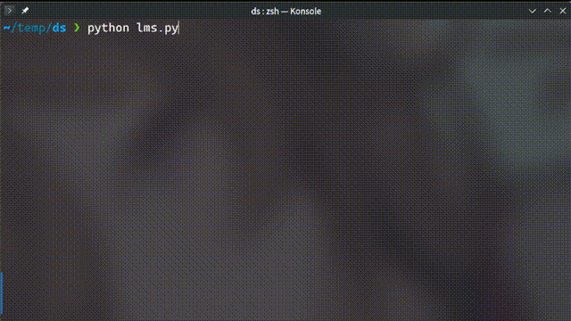

# 🧮 AI 數學輔助機器人

這是一個 **基於大語言模型（LLM）的數學輔助聊天機器人**，它可以：
- **隨機選擇數學題目** 來測試你的數學能力（基於 Ape210K 題庫 📚）
- **檢查你的答案是否正確**，並提供詳細解釋 🤖
- **允許自由提問**，保持對話上下文，讓 AI 持續與你交流 💬
- **支援多種 LLM（Ollama、LM Studio、GPT-4o-mini），可選擇本地或雲端運行 🔥**



---

## 🚀 支援的 LLM 部署方式
| LLM 部署方式  | 是否離線運行 | 需要 API Key | 運行方式 |
|--------------|------------|------------|---------|
| **Ollama** 🖥️ | ✅ 本地運行 | ❌ 無需 API Key | 透過 Ollama 下載 LLM，完全離線執行 |
| **LM Studio** 💻 | ✅ 本地運行 | ❌ 無需 API Key | 需開啟 LM Studio API，透過 `http://localhost:1234` 連接 |
| **GPT-4o-mini** 🌐 | ❌ 需網路連線 | ✅ 需要 OpenAI API Key | 使用 OpenAI API，提供雲端 LLM 支援 |

你可以根據需求選擇不同的 LLM 方式！

---

## 🛠️ 安裝與運行
### **1️⃣ 選擇 LLM 部署方式**
請選擇 **Ollama（本地運行）**、**LM Studio（本地運行）** 或 **GPT-4o-mini（雲端）**。

---

### **2️⃣ 安裝依賴**
若使用 **gpt-4o mini** 需要安裝 Python 依賴：
```bash
pip install requests openai
```
如果使用 **LM Studio**，則需要安裝：
```bash
pip install requests
```

---

### **3️⃣ 下載數學題庫**
我們使用 **Ape210K 數學題庫**（已整理成 JSON 格式）：
```bash
wget -O ape210k_test.json "https://raw.githubusercontent.com/cjzrv/math_assistant/refs/heads/main/ape210k_test.json"
```
請確保 `ape210k_test.json` 存在於專案目錄內。

---

### **4️⃣ 運行不同版本**
#### ✅ **Ollama 本地 LLM**
1. **安裝 Ollama**
   ```bash
   curl -fsSL https://ollama.com/install.sh | sh
   ```
   Windows 用戶請從 [官方網站](https://ollama.com/) 下載並安裝。

2. **下載 LLM 模型**
   ```bash
   ollama pull hf.co/bartowski/Mistral-Nemo-Instruct-2407-GGUF:Q4_K_M  # 或者使用 llama3, gemma 可自行於程式內修改
   ```
   https://huggingface.co/bartowski/Mistral-Nemo-Instruct-2407-GGUF

3. **運行 Ollama 版本**
   ```bash
   python math_assistant_ollama.py
   ```

---

#### ✅ **LM Studio 本地 LLM**
1. **下載 [LM Studio](https://lmstudio.ai/) 並安裝**

2. **下載 LLM 模型**  
https://huggingface.co/bartowski/Mistral-Nemo-Instruct-2407-GGUF

3. **開啟 LM Studio 並啟動 API 服務**
   - 設定 `Local API Server` ✅
   - 預設端口為 `http://localhost:1234`

4. **運行 LM Studio 版本**

   ```bash
   python math_assistant_lm_studio.py
   ```

---

#### ✅ **GPT-4o-mini（雲端 OpenAI API）**
1. **註冊 OpenAI API 並獲取 API Key**

   - [API 註冊](https://platform.openai.com/signup/)

2. **設置 API Key**

   ```bash
   export OPENAI_API_KEY="你的 API Key"
   ```
3. **運行 GPT-4o-mini 版本**

   ```bash
   python math_assistant_gpt4o.py
   ```

---

## 🖥️ 使用方式
當你運行程式後，將會看到如下畫面：
```
🎓 歡迎來到 AI 數學輔助機器人！
🔹 你可以輸入你的答案，AI 會幫你檢查正確性。
🔹 如果有其他問題，也可以繼續提問！
🔹 按 `Ctrl+C` 或 `Ctrl+D` 退出程式。

📌 題目: 小軍身高1.2米，小力的身高比小軍身高的2倍少0.8米，求兩人的平均身高。
✏️ 請輸入你的答案： 1.4米

📖 AI 回答：
✅ 你的答案正確！

💡 你還有其他問題嗎？(輸入問題或按 Enter 讓我出新題目)： 這題怎麼算？

📖 AI 回答：
這道題的計算過程如下...
(逐步輸出計算過程)
```
> 📌 **你可以繼續與 AI 互動，它會記住上下文並回應你的問題！**

---

## 📜 授權
本專案採用 **MIT License**，你可以自由使用與修改，但請保留原作者資訊。

---

## ❤️ 感謝
- [Ollama](https://ollama.com/) 提供本地 LLM 運行環境
- [LM Studio](https://lmstudio.ai/) 提供便捷的本地 LLM 服務
- [OpenAI](https://openai.com/) 提供 GPT-4o-mini API 支援
- [Ape210K](https://github.com/Chenny0808/ape210k) 開源數學題庫
- [Mistral AI](https://mistral.ai/) 提供開源 LLM